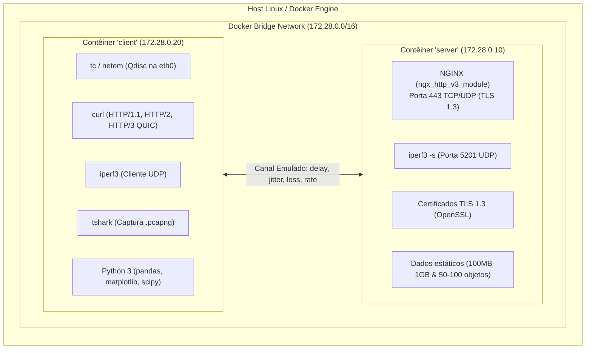

# 01. Arquitetura de Rede e Infraestrutura Docker

**Disciplina:** Redes de Computadores II (2026-2)  
**Instituição:** UFPI — Bacharelado em Sistemas de Informação

---

## 1. Topologia da Rede Experimental

Para isolar o tráfego e permitir a emulação determinística de latência, vazão e descarte de pacotes, a topologia é modelada em contêineres Docker conectados por uma rede bridge isolada com endereçamento estático.



---

## 2. Requisitos de Contêiner e Imagens

### 2.1. Contêiner Servidor (`server`)
- **Base:** `nginx:1.27-alpine` ou Ubuntu customizado contendo NGINX com suporte oficial ao módulo `ngx_http_v3_module`.
- **Serviços Ativos:**
  1. **NGINX:** Escuta na porta 443 TCP (para HTTP/1.1 e HTTP/2 com TLS 1.3) e 443 UDP (para HTTP/3 / QUIC).
  2. **iperf3 Server:** Executando `iperf3 -s -p 5201` em segundo plano para atender aos testes UDP sintéticos.
- **Certificados TLS:**
  - Gerados via OpenSSL autoassinado para o domínio `server` ou `localhost`.
  - Forçamento estrito de cifra moderna e protocolo `TLSv1.3`.
- **Massa de Dados Pré-gerada:**
  - Ficheiro massivo para Cenário B: `100MB.bin` e `1GB.bin` (gerados via `dd if=/dev/urandom` ou `fallocate`).
  - Pasta para Cenário C: 100 arquivos independentes (`obj_001.jpg` a `obj_100.jpg`, ~100 KB a 500 KB cada).

### 2.2. Contêiner Cliente (`client`)
- **Base:** Ubuntu (ex: `ubuntu:24.04`), com privilégios de rede especiais (`cap_add: [NET_ADMIN]`).
- **Pacotes e Utilitários Mandatórios:**
  - `curl` compilado com suporte nativo a HTTP/3 (verificado via `curl --version` exibindo as flags `HTTP3`, `ngtcp2` ou `quiche`).
  - `iperf3` (cliente).
  - `tshark` (Wireshark em modo CLI para gravação `.pcapng` e extração de contadores estatísticos).
  - `iproute2` (para manipulação do `tc` e `netem`).
  - `python3`, `python3-pip`, `python3-pandas`, `python3-matplotlib`, `python3-numpy`, `python3-scipy`.

---

## 3. Especificação do `docker-compose.yml`

Abaixo está o modelo de referência da infraestrutura declarativa para reprodutibilidade total:

```yaml
version: '3.8'

services:
  server:
    build:
      context: ./server
      dockerfile: Dockerfile
    container_name: redes2_server
    hostname: server
    cap_add:
      - NET_ADMIN
    networks:
      redes2_net:
        ipv4_address: 172.28.0.10
    ports:
      - "443:443/tcp"
      - "443:443/udp"
      - "5201:5201/udp"
    restart: unless-stopped

  client:
    build:
      context: ./client
      dockerfile: Dockerfile
    container_name: redes2_client
    hostname: client
    cap_add:
      - NET_ADMIN
    networks:
      redes2_net:
        ipv4_address: 172.28.0.20
    volumes:
      - ../data:/workspace/data
      - ../scripts:/workspace/scripts
      - ../analysis:/workspace/analysis
    depends_on:
      - server
    tty: true

networks:
  redes2_net:
    driver: bridge
    ipam:
      config:
        - subnet: 172.28.0.0/16
          gateway: 172.28.0.1
```

---

## 4. Configuração Crítica do NGINX (`nginx.conf`)

Para suportar simultaneamente HTTP/1.1, HTTP/2 e HTTP/3 (QUIC) na mesma porta (443):

```nginx
events {
    worker_connections 2048;
    use epoll;
}

http {
    include mime.types;
    default_type application/octet-stream;
    
    sendfile on;
    tcp_nopush on;
    tcp_nodelay on;
    keepalive_timeout 65;

    # Configuração TLS 1.3
    ssl_certificate /etc/nginx/certs/server.crt;
    ssl_certificate_key /etc/nginx/certs/server.key;
    ssl_protocols TLSv1.3;
    ssl_prefer_server_ciphers off;
    ssl_early_data on; # Habilita suporte a 0-RTT

    server {
        # Porta 443 para TCP (HTTP/1.1 e HTTP/2)
        listen 443 ssl;
        http2 on;

        # Porta 443 para UDP (HTTP/3 - QUIC)
        listen 443 quic reuseport;

        server_name server;
        root /var/www/html;

        # Cabeçalho para avisar clientes sobre a disponibilidade de HTTP/3
        add_header Alt-Svc 'h3=":443"; ma=86400' always;
        add_header X-Protocol $server_protocol always;

        location / {
            autoindex on;
            try_files $uri $uri/ =404;
        }
    }
}
```

---

## 5. Emulação de Canal com `tc` / `netem`

Para assegurar controle estrito sobre latência, vazão e perdas, as regras de `tc` são aplicadas no contêiner `client` (ou `server`) na interface virtual `eth0`.

### Comandos Essenciais do `tc`:

1. **Limpeza prévia de regras:**
   ```bash
   tc qdisc del dev eth0 root 2>/dev/null || true
   ```

2. **Aplicação de Latência (RTT):**
   ```bash
   # Exemplo: atraso de 10ms (gera RTT ~ 20ms ida e volta)
   tc qdisc add dev eth0 root netem delay 10ms
   ```

3. **Aplicação de Perda de Pacotes Aleatória:**
   ```bash
   # Exemplo: 3% de perda aleatória
   tc qdisc change dev eth0 root netem delay 50ms loss 3%
   ```

4. **Aplicação de Controle de Vazão (Rate Limiting via Token Bucket Filter / TBF):**
   ```bash
   # Limitando a vazão a 100 Mbps com latência
   tc qdisc add dev eth0 root handle 1: netem delay 10ms
   tc qdisc add dev eth0 parent 1:1 handle 10: tbf rate 100mbit burst 32kbit latency 400ms
   ```

5. **Inspeção de regras ativas:**
   ```bash
   tc -s qdisc show dev eth0
   ```

---

## 6. Procedimento de Teste de Conectividade e Validação Inicial

Antes de rodar a bateria científica, validar manualmente cada transporte:

1. **Validar UDP com iperf3:**
   ```bash
   docker compose exec client iperf3 -c 172.28.0.10 -u -b 50M -t 5
   ```
2. **Validar HTTP/1.1:**
   ```bash
   docker compose exec client curl -k --http1.1 https://server/index.html -I
   ```
3. **Validar HTTP/2:**
   ```bash
   docker compose exec client curl -k --http2 https://server/index.html -I
   ```
4. **Validar HTTP/3 (QUIC):**
   ```bash
   docker compose exec client curl -k --http3-only https://server/index.html -I
   ```
   *(Verificar se a resposta contém `HTTP/3 200` e o cabeçalho `alt-svc`)*

---

## 7. Guia de Execução em Host Windows (Docker Desktop + WSL 2)

É perfeitamente possível desenvolver, executar e gravar todo o trabalho a partir de um sistema operacional **Windows**.

### 7.1. Como a conformidade com o edital é garantida
O edital exige que o ambiente de testes seja construído sobre o ecossistema Linux e orquestrado exclusivamente via Docker Compose. No Windows:
- O **Docker Desktop** utiliza o **WSL 2 (Windows Subsystem for Linux)**, executando um kernel Linux real mantido pela Microsoft.
- Os contêineres instanciados (`server` e `client`) são imagens nativas **Linux Ubuntu / Alpine**.
- As chamadas de controle de tráfego (`tc / netem`) e privilégios `NET_ADMIN` operam diretamente sobre o namespace de rede virtual do Linux.
- Na gravação do vídeo de 15 minutos, a interação via terminal (`docker compose exec -it client bash` ou via Windows Terminal conectado ao Ubuntu/WSL) exibe o prompt nativo Linux (`root@client:~#`), atendendo a 100% da expectativa do avaliador.

### 7.2. Cuidado Crítico: Quebras de Linha (`LF` vs `CRLF`)
No Windows, editores de texto podem salvar arquivos com quebra de linha padrão Windows (`CRLF` / `\r\n`). Se um script shell (`.sh`) contiver `\r`, o interpretador bash dentro do contêiner falhará com erros do tipo:
```text
/bin/bash^M: bad interpreter: No such file or directory
```
ou `syntax error near unexpected token $'\r'`.

**Soluções Mandatórias:**
1. **No VS Code:** No canto inferior direito da barra de status, verifique se está selecionado **`LF`** em vez de `CRLF` para todos os arquivos `.sh` e `.conf`.
2. **Arquivo `.gitattributes` no repositório:**
   Adicionar na raiz do projeto para forçar o Git a sempre manter `LF` em scripts:
   ```gitattributes
   *.sh text eol=lf
   *.conf text eol=lf
   Dockerfile text eol=lf
   ```
3. **Conversão rápida se necessário:**
   Dentro do contêiner ou no WSL: `sed -i 's/\r$//' scripts/*.sh`.

### 7.3. Configuração do Docker Desktop
- Verifique em `Docker Desktop > Settings > General` se a opção **"Use the WSL 2 based engine"** está habilitada.
- Se necessário atualizar o kernel WSL no Windows:
  ```powershell
  wsl --update
  ```
